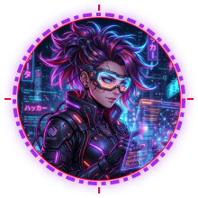

<!-- 
========================================================================
✨ PREMIUM CYBERPUNK ANIME PROFILE README ✨
========================================================================
💡 CRITICAL INSTRUCTION:
Before publishing, replace "YOUR_USERNAME" and "YOUR_NAME" with your actual GitHub username and name.
Search for "YOUR_USERNAME" and "YOUR_NAME" in this file using Ctrl+F or your code editor's search tool.
========================================================================
-->

  <!-- Custom Cyberpunk Animated Hero Banner -->
  

 

  <!-- Animated Typing Banner by DenverCoder1 -->
  

  

<!-- ================= ABOUT ME SECTION ================= -->
<table>
  <tr>
    <td width="30%" align="center" valign="middle">
      <!-- Local circular glowing avatar SVG compiles automatically with python -->
      
    </td>
    <td width="70%" valign="top">
      <h3>📟 SYSTEM_STATUS // PROFILE_INFO</h3>
      <pre>
guest@cyber-core:~# neofetch --user mazka
-----------------------------------------
<b>USER:</b>        YOUR_NAME (aka mazka) <!-- 💡 REPLACE WITH YOUR REAL NAME -->
<b>ROLE:</b>        Cybersecurity &amp; Full-Stack Wizard
<b>STATUS:</b>      Deploying neural algorithms...
<b>LOCATION:</b>    Neo-Jakarta, The Net
<b>SHELL:</b>       zsh (hacking-mode)
<b>NEURAL_OS:</b>   Cyber-Arch v2.0.26
<b>CORES:</b>       Cortex-Neural-9x (12 Threads)
<b>STATUS:</b>      Infiltrating production servers...
      </pre>
    </td>
  </tr>
</table>

### ⚡ About Me

- 🔭 **Active Mission:** Building immersive, high-performance web applications and security automation tools.
- ⚡ **Bio-Telemetry:** Fueled by cold brew coffee, synthwave frequencies, and dark-themed editor screens.
- 💬 **Data Exchange:** Ask me about React, Next.js, Rust microservices, or secure system architecture.

  

<!-- ================= TECH STACK SECTION ================= -->

  <h3>🛠️ NEURAL_INTERFACE // SKILL_MATRIX</h3>

#### 🌐 Frontend Stack
 &nbsp;
 &nbsp;
 &nbsp;
 &nbsp;
 &nbsp;
 &nbsp;

#### ⚙️ Backend & Database
 &nbsp;
 &nbsp;
 &nbsp;
 &nbsp;

#### 🗡️ Languages & Tools
 &nbsp;
 &nbsp;
 &nbsp;
 &nbsp;

  

<!-- ================= GITHUB ANALYTICS SECTION ================= -->

  <h3>📊 NEURAL_NET // DATA_ANALYTICS</h3>
  
  <!-- 💡 REPLACE ALL THREE INSTANCES OF "YOUR_USERNAME" BELOW WITH YOUR ACTUAL GITHUB USERNAME -->
  
  &nbsp;&nbsp;
  
  
    
  
  

  

<!-- ================= SUPPORT SECTION ================= -->

  <h3>☕ SYSTEM_SUPPORT // FUEL_CELLS</h3>
  
  <!-- 💡 REPLACE THE LINKS BELOW WITH YOUR ACTUAL PROFILE LINKS -->
  
  &nbsp;&nbsp;&nbsp;&nbsp;
  
  &nbsp;&nbsp;&nbsp;&nbsp;
  

